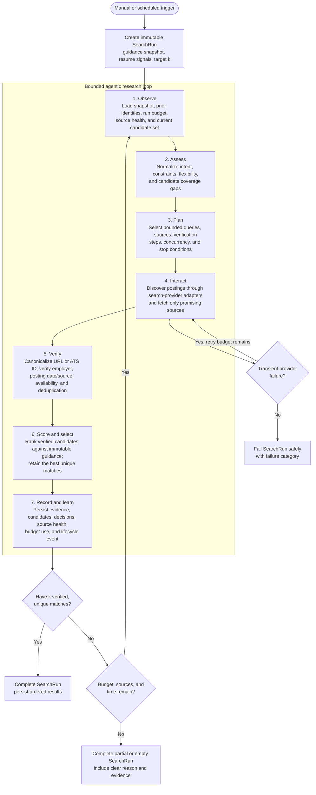
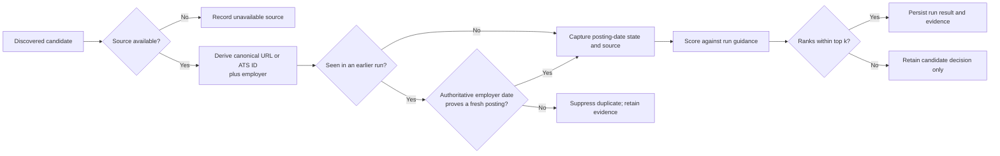
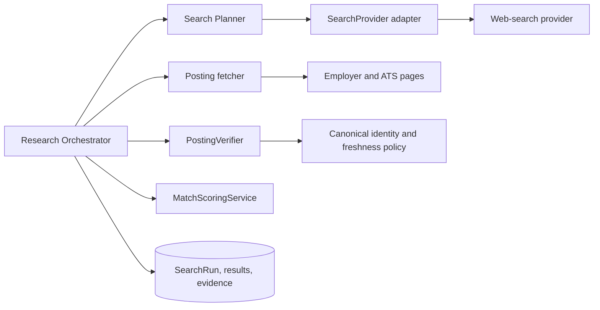
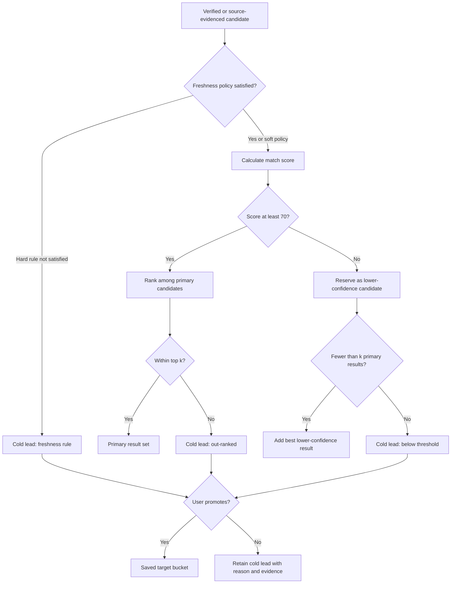
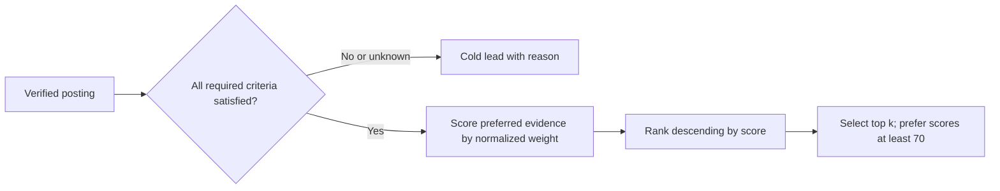

# JoBatea - Agentic Job Search Loop v1

Status: Planned backend architecture. This describes the future research
orchestrator; it does not represent currently implemented behavior.

Updated: 2026-08-31

## Goal

For one immutable `SearchRun`, return up to $k$ unique job postings that best
match the user's saved guidance and usable resume. Every returned posting must
have source evidence, a canonical identity, and an explicit verification state.

The loop ends when it has $k$ verified matches, its bounded search budget is
exhausted, or it reaches a terminal failure. It must return an explicit
completed, partial, empty, or failed run state; it must never silently relax
the user's must-have constraints.

## Seven-Stage Loop

## Stage Responsibilities

| Stage | Input | Output | Non-negotiable guardrail |
| --- | --- | --- | --- |
| Observe | `SearchRun` snapshot, source health, prior canonical identities | Current execution context | Never read mutable criteria as the source of truth for an active run. |
| Assess | Execution context | Structured search intent and coverage gaps | Keep must-haves distinct from preferences and flexibility rules. |
| Plan | Intent, remaining budget | Provider queries and verification plan | Bound query count, fetched pages, time, and provider spend. |
| Interact | Provider plan | Unverified candidate postings and retrieval evidence | Use provider adapters, timeouts, bounded concurrency, and retry policy. |
| Verify | Candidate URL, source page | Canonical identity, date/source state, duplicate decision | Only employer or ATS evidence can establish an authoritative posting date. |
| Score and select | Verified unique postings, guidance snapshot | Ordered candidate set of at most $k$ postings | Do not return a posting merely because it was found again. |
| Record and learn | Decisions, evidence, lifecycle events | Immutable result set and operational metrics | Do not overwrite prior run results or guidance snapshots. |

## Candidate Decision Path

## Provider Boundaries

The search provider discovers candidates quickly. The posting fetcher and
verifier establish whether a candidate is trustworthy enough to return. This
separation permits provider changes without weakening the product's freshness
or deduplication promise.

## Initial Discovery Provider

V1 development uses Tavily for all broad discovery through the `SearchProvider`
adapter. The adapter performs one basic Tavily query per planned query and
returns at most five results per query by default; configuration may increase
that value only to a hard maximum of 10. A plan therefore produces at most 50
raw candidate URLs under the current 10-query limit before verification.

Each Tavily response counts as one fetched search page. Results are discovery
candidates only: they have no assumed employer, canonical identity, or verified
posting date. Direct employer/ATS fetches remain the responsibility of Verify.
When `TAVILY_API_KEY` is absent, the provider remains unavailable and queued
runs fail safely with `provider_unavailable`.

## Initial Posting Verification

V1 verification supports Greenhouse posting URLs only. The `PostingFetcher`
recognizes Greenhouse board URLs and retrieves the matching structured public
job record from the Greenhouse job-board API. This establishes a canonical ATS
job ID, title, location, and source evidence without HTML scraping or provider
credentials.

Greenhouse's API `updated_at` value is not treated as an authoritative posting
date. The fetcher therefore reports no verified date until the date policy is
supported by reliable source evidence. Unsupported URLs become `unverified_source`
cold leads; they are not returned as primary results.

## Lifecycle and Terminal States

| State | Meaning |
| --- | --- |
| `queued` | A run was created and awaits a worker. |
| `running` | The loop is executing with bounded budget. |
| `completed` | $k$ matches were found and persisted. |
| `partial` | Fewer than $k$ matches passed verification before budget exhaustion. |
| `empty` | No matches passed verification; record whether criteria, source coverage, or availability caused it. |
| `failed` | A non-retryable technical, provider, or validation failure ended the run. |

## Required Decisions Before Implementation

- Choose the production web-search provider and define cost, rate-limit, and
  acceptable-use budgets.
- Define the canonical posting identity contract: preferred authoritative URL,
  ATS ID extraction rules, employer normalization, and fresh-posting evidence.
- Define `SearchRun`, run result, retrieval-evidence, and failure-category
  persistence models.
- Choose queue and worker infrastructure before enabling scheduled execution.
- Define the frontend polling or event contract for safe running-state updates.

## V1 Execution Policy Decisions

The following decisions define the initial `ResearchContext` and `SearchPlan`
contract. They are product policy for v1 and should be centralized as defaults
when implementation begins, rather than scattered across agent stages.

| Policy | V1 decision |
| --- | --- |
| Result target | The user chooses $k$, where $1 \leq k \leq 10$. |
| User inputs | Before a run, the user controls role, location/work style, must-haves, preferences, exclusions, freshness preference, flexibility, and $k$. |
| Global time limit | The run has a hard stop of $3k$ minutes. The preferred completion target is $2k$ minutes. |
| Fetch budget | At most $150k$ fetched pages. Every network retrieval counts: search-engine result pages, provider result pages, employer pages, ATS pages, redirects, and detail pages. |
| Token budget | Start with a 60,000-token hard cap per run and a 45,000-token warning threshold. Reuse a concise resume/profile summary rather than repeatedly sending full resume text. |
| Canonical identity | A canonical employer URL or an ATS job ID plus normalized employer is sufficient to identify a posting. |
| Date evidence | Greenhouse, Workday, Ashby, and employer-career-page dates are authoritative. Other dated sources are retained as `freshly reposted on <date>, unverified`. |
| Score threshold | Scores at or above 70/100 are eligible for the primary result set. Prefer stronger results when more than $k$ qualify. If fewer than $k$ qualify, fill remaining slots with the best lower-scoring results and label them as lower-confidence matches. |
| Cold leads | Retain candidates excluded from primary results with the decision reason and evidence. Users may manually promote a cold lead to their saved target bucket. |
| Freshness rule | A user may select freshness as a hard constraint. When hard, unverified repost dates and postings outside the configured age window are excluded from primary results. When soft, a strong unverified repost may appear with its verification state. |

## Result Selection and Cold Leads

Each cold lead records title, company, source URL, retrieval time, canonical
identity when available, score/rationale when available, evidence, and one
machine-readable stop reason: `freshness_rule`, `below_match_threshold`,
`out_ranked`, `possible_duplicate`, `unverified_source`, or
`budget_exhausted`.

## Initial Deterministic Scoring Model

Scoring is deterministic and explainable, but the user's saved scoring policy
controls whether a criterion is required, preferred, flexible, or ignored.
Required criteria are eligibility gates; they are never converted into a small
score penalty. Unknown source data is not treated as a match.

| Category | Default weight | Input evidence | User mode |
| --- | ---: | --- | --- |
| Target roles | 35 | Posting title and description | `required`, `preferred` |
| Location | 20 | Posting location | `required`, `preferred`, `flexible` |
| Work style | 15 | Posting title, location, description | `required`, `preferred`, `flexible` |
| Experience level | 15 | Posting title and description | `required`, `preferred`, `flexible` |
| Company/industry preferences | 15 | Employer and posting description | `preferred`, `ignore` |

Weights are normalized to 100 after the user changes them. The result stores a
per-category score, maximum, state, and matched evidence, plus a concise
rationale. A result scoring at least 70 is preferred. If fewer than $k$ pass
that threshold, the best eligible lower-confidence results fill the remaining
slots; otherwise low-scoring or out-ranked postings remain cold leads.

