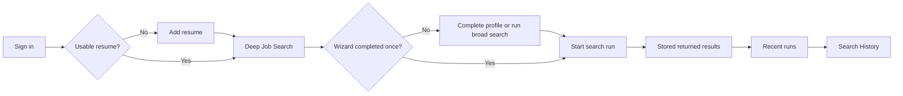

# JoBatea - Tentative Deep Job Search Workflow v1

Status: Tentative active v1 handoff for engineering review.
Updated: 2026-08-31

## Screen Inventory

| Screen/state | Primary user action | Required outcome |
| --- | --- | --- |
| Deep Job Search, resume missing | Add resume | User reaches a usable resume input without losing context |
| Deep Job Search, broad-search ready | Complete profile or run broad search | User can refine criteria or knowingly continue with lower precision |
| Profile and Criteria | Review/edit wizard inputs and Additional Context | Saved inputs regenerate the agent guidance sheet |
| Returned results for a run | Open original posting or return to history | User reviews the immutable result set for one completed run |
| Search History | Open any prior run | User accesses a paginated, immutable run list and its stored results |

## Approved v1 Decisions

- Name plus usable resume are required to search. Location is optional.
- The wizard is recommended until it is completed once, then remains available
  for refinement.
- Search profile completion is a compact, advisory donut; it is not candidate
  quality and it does not block a ready user.
- The agent uses a generated Markdown guidance sheet derived from saved profile
  data and optional Additional Context. Users do not directly edit generated
  Markdown in v1.
- Deep Job Search shows three recent runs. Search History shows all runs.
- Runs and their guidance snapshots are immutable. Duplicate postings do not
  recur unless authoritative employer posting-date evidence confirms freshness.

## Layout and Navigation

Desktop is the primary experience. Use a persistent, compact application shell
with Deep Job Search, Profile and Criteria, Search History, Statistics, and
account actions. Keep the workspace utilitarian: a constrained content width,
8 px spacing scale, modest 6-8 px radii, and dense but readable data.

Deep Job Search contains the current search command, compact Search profile
control, generated guidance preview, run-specific returned results, and at most
three recent runs. Profile and Criteria owns resume input, guided setup, and
Additional Context. Search History contains all runs using pagination or
progressive loading. Mobile supports account access, essential input correction,
search monitoring, and compact result review; it does not reproduce desktop
multi-column research workflows.

## Search Profile and Readiness

- Account name plus usable resume text are required to search. A stored file
  without extractable or manually pasted text is not usable.
- Show an explicit prerequisite message and **Add resume** action when search
  is unavailable; never present a dead-end disabled command.
- Search profile completion is an advisory 48 px donut button, not candidate
  quality. Hover, keyboard focus, and activation reveal completed inputs,
  recommended next inputs, and an action to complete or refine the profile.
- The button supports visible focus, `aria-expanded`, Escape-close, and focus
  restoration. It must provide the same details without pointer hover.
- Profile strength: resume 40%; target roles 20%; work style or location 15%;
  company or industry preferences 10%; work/team requirements 15%.
- Before first wizard completion, every search confirmation recommends the
  wizard but permits an explicitly labelled broad search. After completion, the
  entry point becomes **Refine profile**.

## Prompt Guidance Sheet

Generate a readable Markdown guidance sheet from successfully saved profile and
wizard data. Do not permit direct editing of generated Markdown in v1. Include:

- Candidate context: resume-derived strengths plus optional Additional Context.
- Target roles and seniority.
- Location, work style, and relocation flexibility.
- Must-haves, salary target/floor, skills/certifications, and voluntarily
  provided eligibility constraints.
- Nice-to-haves, work/team preferences, target companies, and industries.
- Excluded roles, companies, and industries.
- Freshness/repost settings, result count, and flexibility rules.

Persist Additional Context separately. Render absent sections as `Not specified`.
Do not show newly edited values as agent-ready until their save succeeds.

## Search Runs, Results, and History

- Starting research creates an immutable `SearchRun` with a guidance snapshot,
  timestamps, lifecycle state, broad-search indicator, result count, and safe
  failure category.
- Returned results belong to one run. They show company, title, posting-date
  status/source, match score, concise rationale, and original-posting action.
- A result may include description, company context, hiring-process information,
  interview preparation material, and third-party ratings when available. Each
  enriched field includes source, retrieval date, and unknown/unavailable state.
- Results cannot be duplicated across runs solely because they were found again.
  Use canonical source URL or ATS job ID plus employer. Re-return only when
  authoritative employer posting-date evidence establishes a fresh posting.
- Recent searches display three newest runs. Search History provides paginated
  access to all runs, including date/time, criteria summary, run state, count,
  and stored-result link. Re-running creates a new run; it never overwrites one.

## Required States and Accessibility

Implement default, hover, focus-visible, selected, disabled, loading, empty,
success, warning, error, validation, and partial-data states for resume input,
criteria save, profile completion, search execution, results, and history.

- Preserve unsaved criteria after a save failure and offer retry.
- Explain zero results as restrictive criteria, unavailable source data, or
  technical failure; offer reversible refinements without silently relaxing
  requirements.
- Do not consume a free search round for technical failure.
- Use semantic controls, linked form errors, accessible dialogs, text status,
  visible focus, sufficient target size, and non-color-only state indicators.
- Provide text alternatives or tabular summaries for charts and a narrow-screen
  alternative for result tables.

## Backend and Frontend Dependencies

- Backend/data: usable-resume signal; `SearchRun`; immutable guidance snapshots;
  run/job association; canonical source identity; authoritative posting date and
  source; enrichment state; recent/history/run-result APIs; safe failure shape.
- Frontend: app shell and routes; resume prerequisite; profile button/popover;
  resumable wizard; Additional Context; generated guidance preview; broad-search
  confirmation; run-specific results; recent runs; paginated history.
- Development research uses shared provider configuration. User API-key entry is
  out of the active flow.

## Primary Flow

## Implementation Handoff

The Frontend SWE should begin with the shell/navigation, profile-completion
button/popover, resume prerequisite state, broad-search confirmation, and
recent-runs section. The full history and run-specific results require the
planned `SearchRun` backend/data contract in `TODO.md`.

The Lead Backend SWE/Data owner needs to define `SearchRun`, immutable guidance
snapshots, run lifecycle/failure shape, pagination, and canonical posting
identity plus authoritative-date freshness semantics before the history UI can
use real data.

## Superseded Artifacts

This document consolidates the active requirements formerly distributed across
`ui-requirements.md`, `onboarding-search-readiness-spec.md`, and
`onboarding-search-history-v1-spec.md`. Their archive records are in
`archive/`; the low-fidelity visual handoff is
`deep-job-search-workflow-v1-low-fi.svg`.